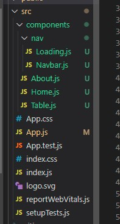
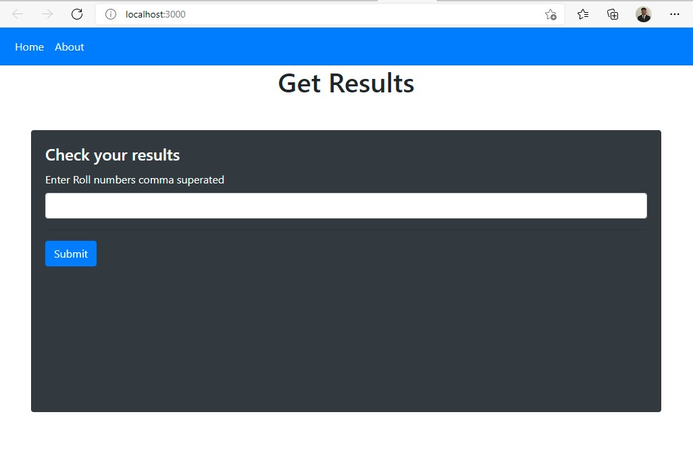
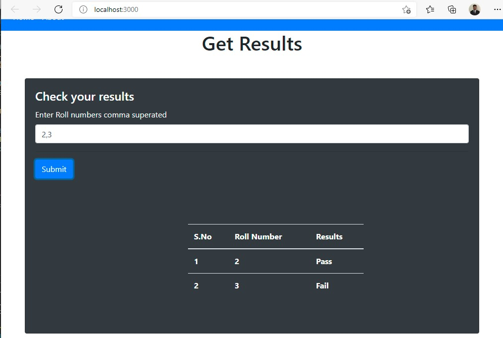
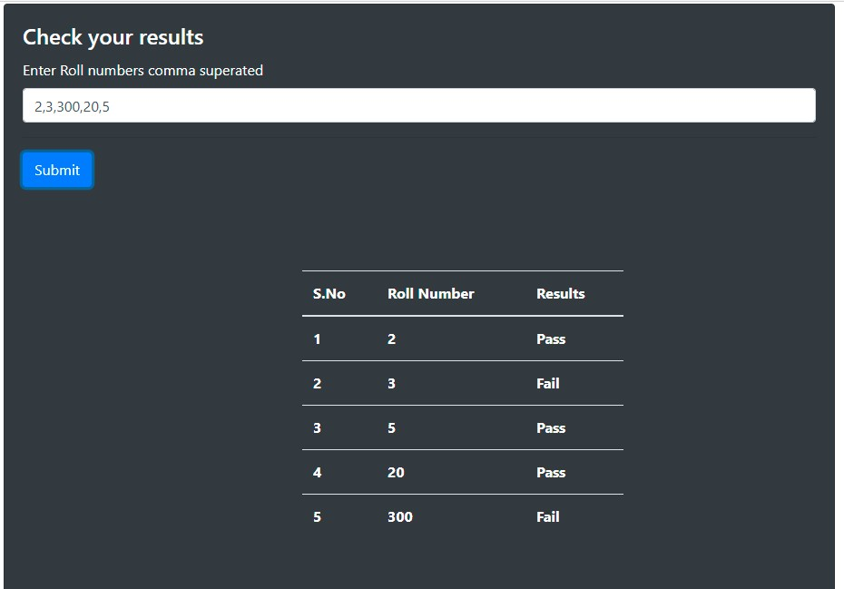
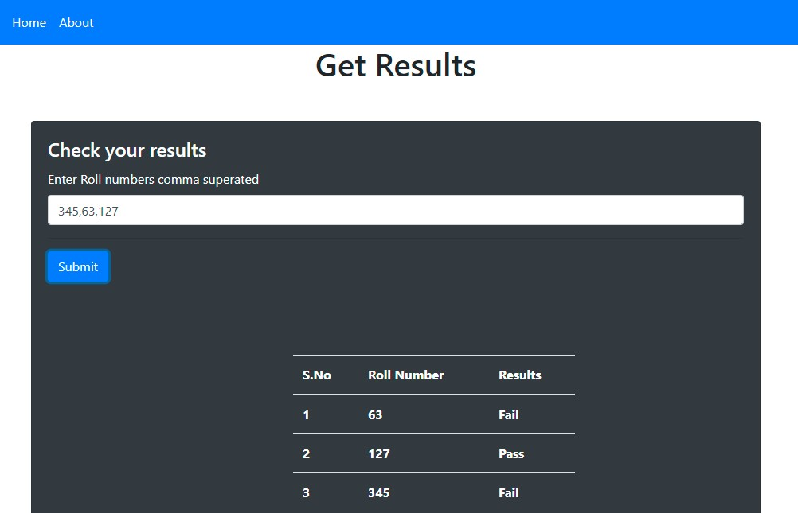
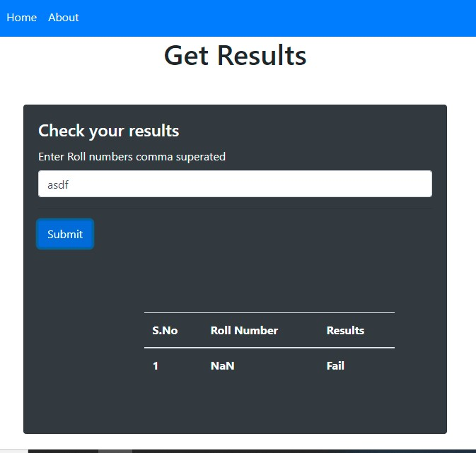
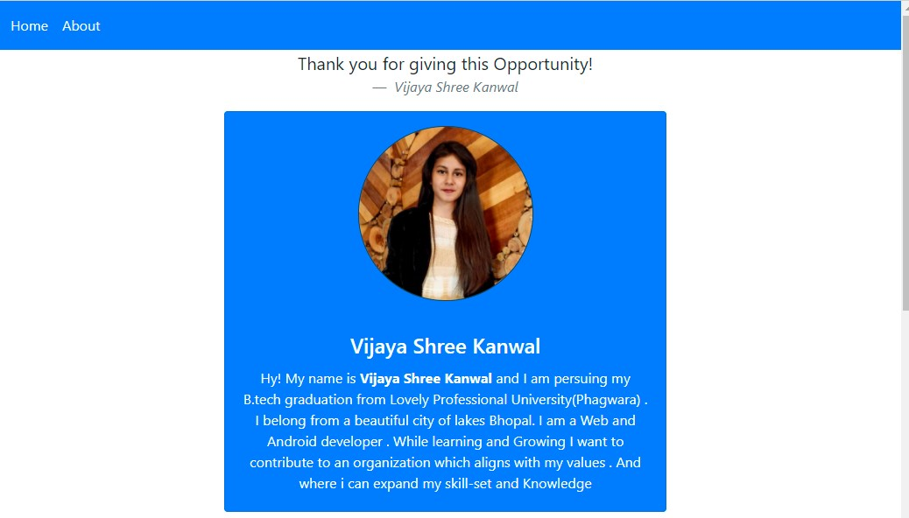
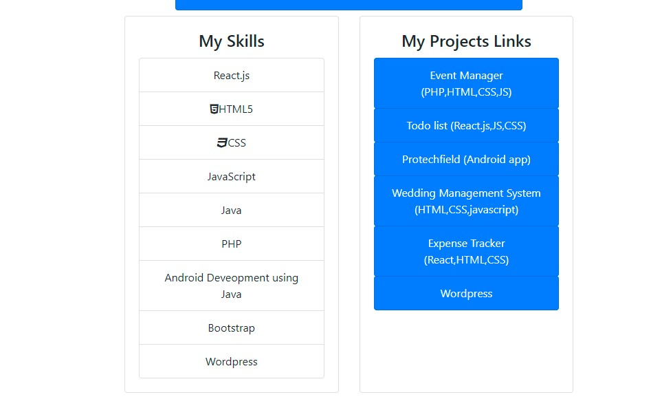

# React App Invictus Assignment

A word count Analyser

<h3>Firebase Hosted link</h3>
<a href="https://invictus-assignment.web.app/"><h4>https://invictus-assignment.web.app/</h4></a>

#Components
<h1>App.js</h1>
It is a functionaly component. 
First we stat with App.js here I added routing using "react-router-dom". 
 
App.js also import Navbar.js component from componet/nav folder and set  on top of all components to visible in all pages.
 
It has 2 routs 
/ and /about 2 routs are added to this simple app. 
<h1>Home.js</h1>
it is a class component. 
/ will render Home.js component. I has the input form that allows used to enter input value of N and submit. 
 
in Home component on submit of the form it will pass data to the <h3>getwords()</h3>  function this fetch the data asynchronously using <strong>fetch().then()</strong>  methods 
once the data is fetched it will set the state data value and then call <h3>GetTopWords()</h3> funciton.
This funciton will update the state dictionary with top N frequency words.
<h1>Test Cases 1: </h1>

Input: 2
 output below image 
 
<h1>Test Cases 2: </h1>

Input: 2
 output below image 
 
<h1>Test Cases 3: </h1>

Input: 12
 output below image 
 

 
as the sate gets update React will automatically update the state every where which results in call of  
<h1>Table.js</h1>
it is a class component. 
Table component it will create table using the data pased as props.
  
In Table this will receive the top N frequency words object in the form of props and crate a Table and display it to users.

 
<h1>Navbar.js</h1>
it is a functional component. 
It returns a nav bar that is build using bootstrap 4.
<h1>About.js</h1>
it is a class component. 
About.js component is all about me any my skills. Please check my skills match this role really well. 

 
Please give me a opportunity I am interested in both web and Android Deveopment. 
I am best in desigining websites and good in React.js ,Javascript ,CSS. I  also know PHP and many other technologies like redux ,using of firebase firestore. 
I am quick learner and hard worker. 
 In the past 3 years I learned so many skills I am interested in making websites and Android Applications.

<h4>-Thank you</h4>

